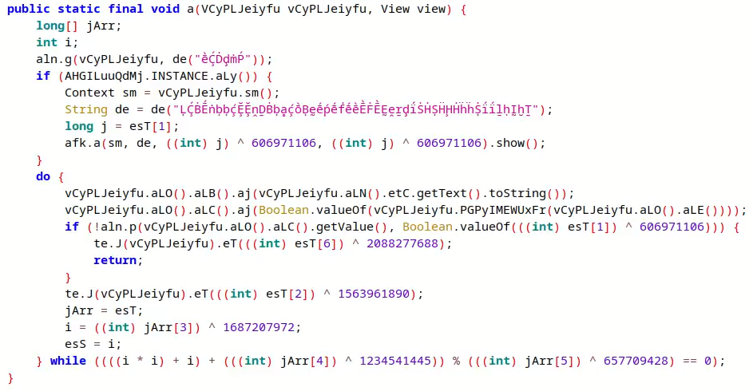
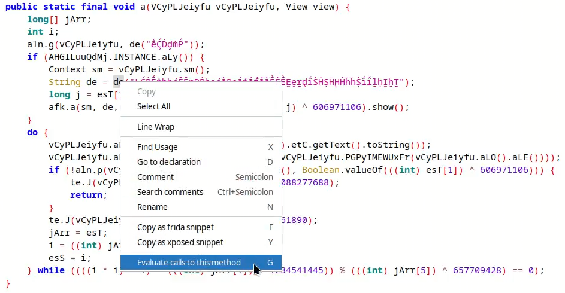
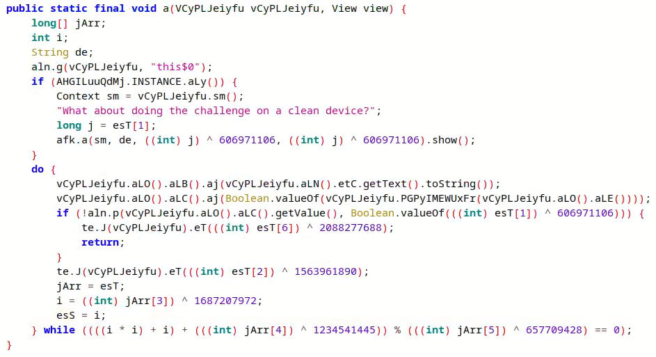

## jadx-eval-method

A PoC decompiler plugin for jadx-gui. Evaluates methods in runtime using frida and updates the decompiler output with the result. Main idea was to develop something specific to help solving [the open obfuscator challenge](https://obfuscator.re/challenges/2022-12-android-challenge/).

Works only on methods with a single string argument.

Before:



Righ click on the method and select "Evaluate calls to this method":



After eval:



## How to build

First copy or symlink the adb module from android sdk:

```
$ ln -s $NDK_HOME/python-packages/adb frida-proxy/adb
```

If you updated the protobuf, regenerate the python modules:

```
$ python -m grpc_tools.protoc -I src/main/proto --python_out=frida-proxy --pyi_out=frida-proxy --grpc_python_out=frida-proxy rpc.proto
```

Keep the frida-proxy daemon running on the side (dont forget to keep a phone or an emulator up):

```
$ cd frida-proxy
$ pip install -r requirements.txt
$ python main.py
```

Build the project:

```
$ ./gradlew dist
```

Install the plugin on jadx:

```
$ jadx plugins -j build/dist/jadx-eval-method.jar
```

Run jadx-gui:

```
$ jadx-gui challenge-pydroid.apk
```